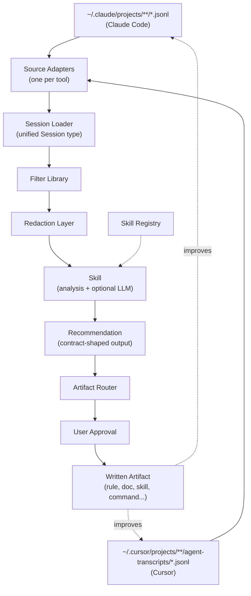

# Architecture

This document describes the technical design of the platform: where data comes from, how the kernel processes it, how skills plug in, and how recommendations become artifacts. It is detailed enough to implement from — that's the goal.

---

## Data sources

vibe-os reads session data from any supported AI coding tool. Each tool stores its session history locally in a different location and format. The kernel abstracts these differences behind a unified `Session` type.

### Claude Code

```
~/.claude/projects/<encoded-path>/<session-uuid>.jsonl
```

The `<encoded-path>` is the absolute project path with `/` replaced by `-` (e.g. `/Users/alice/dev/myapp` → `-Users-alice-dev-myapp`). Each line in the JSONL file is one event.

**Reliable event fields:**

| Field | Type | Description |
|---|---|---|
| `type` | string | Event type: `user`, `assistant`, `tool_result`, `summary` |
| `uuid` | string | Event ID |
| `timestamp` | string (ISO 8601) | When the event occurred |
| `sessionId` | string | Session the event belongs to |
| `message` | object | Present on `user` and `assistant` events |

Assistant messages contain a `content` array of `text` and `tool_use` blocks. Tool results carry the output and an `is_error` flag.

### Cursor

```
~/.cursor/projects/<encoded-path>/agent-transcripts/<session-uuid>.jsonl
```

The `<encoded-path>` encoding follows the same convention as Claude Code. The event schema differs from Claude Code but maps to the same kernel types. The source adapter for Cursor handles this translation.

**What to treat with caution across both tools:**
- Timestamps are reliable for ordering within a session; cross-session timezone handling needs care.
- Token counts are not always present at the event level.
- File content appearing inside tool calls should be treated as evidence of a touch, not as the canonical file source.
- A user can have multiple sessions open in parallel for the same project.

### Adding a new source

New tools are added by writing a source adapter — a module that reads the tool's raw session format and returns the kernel's `Session` type. The kernel's filter library and all skills work unchanged. See [CONTRIBUTING.md](CONTRIBUTING.md) for the adapter contract.

---

## Scope model

Every query and every artifact has a scope: **global** or **project**.

### Global scope

- Loads sessions from all project directories across all supported tools.
- Produces insights about the user as a person: habits, style, cross-project patterns.
- Artifacts are written to global config locations: `~/.claude/CLAUDE.md`, `.cursor/rules/` (global), `~/.claude/skills/`, `~/.claude/commands/`.

### Project scope

- Loads sessions only for the current or named project, across all supported tools (Claude Code sessions for that project + Cursor sessions for the same project).
- Produces insights about a specific codebase: its missing docs, project-specific rules, internal conventions.
- Artifacts are written into the project itself: `<project-root>/CLAUDE.md`, `<project-root>/.cursor/rules/`, `<project-root>/docs/`.

### How scope is selected

Skills receive scope as an input — a CLI argument, an environment variable, or in conversational use, a prompt from the user. The kernel filter library accepts a `scope` parameter:

- `{ kind: "global" }` — all projects, all tools
- `{ kind: "project", path: "/abs/path/to/project" }` — one project, all tools

The artifact router uses the same scope object to decide where to write outputs.

### Deriving the project path

When running inside an AI coding session, the current working directory is the project root. The kernel can derive the encoded path from it. Skills should not hard-code encoded paths — always derive them at runtime from the current directory or an explicit argument.

---

## Substrate layers

These are the shared building blocks all skills use. They are described here as interfaces — implementation language, file layout, and packaging are v0 decisions.

### Source adapters

**Responsibility:** Translate a tool's raw session format into the kernel's typed `Session` objects.

**One adapter per tool:**
- `adapters/claude-code.js` (or equivalent) — reads `~/.claude/projects/`
- `adapters/cursor.js` — reads `~/.cursor/projects/`

**Adapter contract:** Each adapter exports a single function:

```
readSessions(scope: Scope) → Session[]
```

It handles path encoding/decoding, JSONL parsing, and mapping to the shared `Session` type. It does not filter, redact, or analyze — that's downstream.

### Session loader

**Responsibility:** Given a scope, call the right adapters and return a merged, deduplicated list of `Session` objects.

**Output — `Session` type:**

```
Session {
  id: string
  source: "claude-code" | "cursor" | string   // which tool produced it
  projectPath: string                           // absolute project path
  projectKey: string                            // encoded path key
  startedAt: Date
  endedAt: Date
  model: string | null
  events: Event[]                               // ordered
  turnCount: number
  isAbandoned: boolean                          // heuristic
}
```

**Does not:** Parse file contents, count tokens precisely, or redact anything.

### Filter library

**Responsibility:** Apply common filters so skills don't repeat boilerplate.

**Filters:**

| Filter | Description |
|---|---|
| `byDateRange(start, end)` | Sessions that overlap the given period |
| `byProject(path)` | Sessions for one project (all tools) |
| `bySource(tool)` | Sessions from a specific tool only |
| `byModel(modelId)` | Sessions that used a specific model |
| `byToolUsed(toolName)` | Sessions containing a call to the named tool |
| `byOutcome(outcome)` | `"success"`, `"abandoned"`, or `"error"` |
| `containingText(text, role)` | Sessions where a message from the given role contains the text |

### Redaction layer

**Responsibility:** Strip sensitive content from text before passing it to a language model.

**What it redacts:**
- JWT tokens (`eyJ...` prefix)
- API keys (`sk-`, `ghp_`, `Bearer `, long hex/base64 strings adjacent to known keywords)
- `.env` file content (key=value lines)
- Absolute file paths that contain usernames (replaced with `~`)
- IP addresses and internal domain names (configurable; off by default)

**Behavior:**
- Returns a redacted copy; never mutates the original.
- Marks redacted spans so the skill can report "N secrets removed" without exposing what they were.
- Pure function, no network access.

**When to use it:** Every time user-authored text is passed to a language model. Stats-only skills that never call an LLM do not need to redact.

### Recommendation contract

**Responsibility:** Define the shape of every skill output so all skills speak the same language and downstream tools (rule-creator, artifact router) can consume any skill's output.

**Schema:**

```json
{
  "title": "string",
  "summary": "string — 1-3 sentences: what was found and why it matters",
  "evidence": [
    {
      "sessionId": "string",
      "source": "string — which tool produced this session",
      "projectKey": "string",
      "timestamp": "string (ISO 8601)",
      "excerpt": "string — relevant portion of the session, post-redaction"
    }
  ],
  "scope": {
    "kind": "global | project",
    "path": "string | null"
  },
  "proposedArtifact": {
    "type": "rule | skill | slash-command | agent | doc | note | stat | none",
    "destination": "string — where the artifact should be written",
    "content": "string — full draft content of the artifact"
  },
  "confidence": "high | medium | low",
  "rationale": "string — why this confidence level; what would make it higher"
}
```

**Rules for producing recommendations:**
- `evidence` must not be empty. At least one citation is required.
- `excerpt` must be post-redaction.
- `confidence: high` — pattern appeared in 5+ sessions or a very recent burst.
- `confidence: low` — appeared twice, or an alternative explanation exists.
- Return an empty list when no pattern is found. Never return a low-confidence placeholder.

### Artifact router

**Responsibility:** Write approved artifacts to the right location, in the right format, without duplicating or conflicting with existing content.

**Destinations by type and scope:**

| Type | Global destination | Project destination |
|---|---|---|
| `rule` | `~/.claude/CLAUDE.md` | `<root>/CLAUDE.md` |
| `rule` (Cursor) | `.cursor/rules/` (global) | `<root>/.cursor/rules/<name>.mdc` |
| `skill` | `~/.claude/skills/<name>/SKILL.md` | Not applicable |
| `slash-command` | `~/.claude/commands/<name>.md` | `<root>/.claude/commands/<name>.md` |
| `agent` | `~/.claude/agents/<name>.md` | `<root>/.claude/agents/<name>.md` |
| `doc` | Not applicable | `<root>/docs/<name>.md` |
| `note` | `~/.claude/CLAUDE.md` (note block) | `<root>/CLAUDE.md` (note block) |

Before writing:
1. Check for conflicting or duplicate content in the destination file. Surface conflicts before writing.
2. For `rule` and `note` types, append under a section header; never replace the entire file.
3. Show the exact diff to the user before confirming.
4. Never write without explicit user confirmation.

### Skill registry

**Responsibility:** Allow skills to declare their outputs and discover other skills' outputs.

**What it tracks:**
- Which skills are installed and from which source
- What recommendation types each skill produces
- What evidence types each skill consumes

**Primary use case:** `vibe-rule-creator` advertises that it consumes any recommendation with `proposedArtifact.type === "rule"`. Any other skill can emit such a recommendation and know that rule-creator will handle the writing.

---

## Skill anatomy

```
skills/
└── <skill-name>/
    ├── SKILL.md           — triggers, instructions, workflow (required)
    ├── references/        — supplementary docs loaded on demand
    ├── scripts/           — executable scripts using the kernel
    └── fixtures/
        ├── claude-code-example.jsonl   — synthetic Claude Code session
        └── cursor-example.jsonl        — synthetic Cursor session
```

### What SKILL.md must contain

- **Frontmatter**: `name`, `description`
- **Scope declaration**: which scopes and how behavior changes between them
- **Source support**: which tools' sessions the skill analyzes (most skills should support all)
- **Evidence spec**: what the skill looks for (tool types, message patterns, files, etc.)
- **Output spec**: what recommendations it produces, with example `proposedArtifact` shapes
- **Kernel dependencies**: which layers it uses
- **LLM usage**: whether it calls a model, and at which step

### What a skill can assume

- The kernel provides typed `Session` objects.
- Sessions from all supported tools are available through the same API.
- The filter library is available and accepts the scope object.
- The redaction layer is available as a pure function.
- The artifact router handles all writes after approval.

### What a skill must not do

- Read JSONL files or tool-specific directories directly.
- Write to disk without the artifact router.
- Pass un-redacted user text to a language model.
- Make network calls without disclosing them in SKILL.md.
- Produce recommendations without evidence citations.
- Assume sessions come from one specific tool.

---

## Privacy and cost model

### Local-first default

All data processing runs locally. The kernel reads files from the local filesystem. No data leaves the machine unless the user explicitly opts in to a skill that requires it.

### Redaction-before-LLM

Any skill that calls a language model must pass its inputs through the redaction layer first. This applies to local model calls as well.

### External call disclosure

Skills that require external calls must:
- Disclose this in their `SKILL.md` under a `## External calls` section.
- Require explicit user opt-in at runtime.
- Never send more data than the minimum required.

### Cost model

Skills that use language models should prefer:
1. Local models for tasks that don't require high capability.
2. The model already active in the session (no extra cost).
3. An explicit cost disclosure if the skill would incur additional API cost.

---

## Data flow



The dashed arrows back to the data sources represent the closed loop: artifacts improve future sessions, which produce better evidence, which produce better recommendations.
