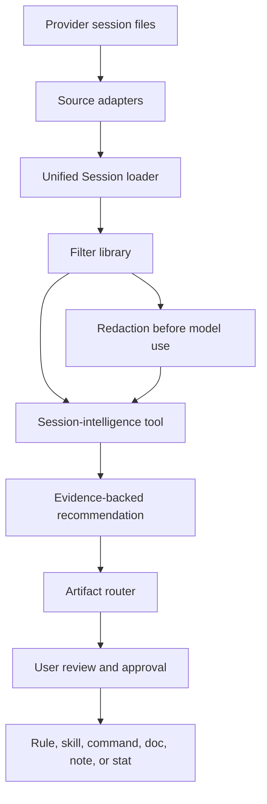

# Session Intelligence

Session intelligence is the part of vibe-os that learns from recorded AI-assisted software work. It turns local transcripts into evidence-backed observations and proposed improvements while protecting sensitive context.

This document preserves the original technical design of vibe-os as a dedicated subsystem. The adapters, unified `Session` model, analysis scopes, redaction rules, recommendation contract, and reference skill briefs below apply to session-intelligence tools. They are not universal requirements for unrelated vibe-os tools.

> **Status:** This is an implementation-ready design, not a claim that the kernel or reference skills have shipped.

## Purpose and boundaries

AI coding sessions contain behavioral evidence: prompts, tool use, retries, file references, failures, explanations, and successful workflows. Session-intelligence tools use that evidence to produce specific, reviewable insights or artifacts.

The subsystem follows stricter rules than vibe-os as a whole:

- Claims about user behavior cite the sessions that support them.
- User-authored transcript text is redacted before any model call.
- Tools consume normalized sessions rather than reading provider formats directly.
- Analysis explicitly selects global or project scope.
- Proposed mutations flow through an approval-aware artifact router.
- Tools return no recommendation when the evidence is insufficient.

## Data sources

### Claude Code

Claude Code stores project sessions at:

```text
~/.claude/projects/<encoded-path>/<session-uuid>.jsonl
```

The encoded path is the absolute project path with `/` replaced by `-`. Each line is an event. Reliable fields include `type`, `uuid`, `timestamp`, `sessionId`, and `message` on user and assistant events. Assistant messages contain text and tool-use blocks; tool results carry output and an error indicator.

### Cursor

Cursor stores project transcripts at:

```text
~/.cursor/projects/<encoded-path>/agent-transcripts/<session-uuid>.jsonl
```

Cursor's event schema differs from Claude Code's schema but maps to the same subsystem types through a source adapter.

### Source cautions

- Timestamps are reliable for ordering within a session; cross-session timezone handling needs care.
- Token counts are not always available per event.
- File content inside tool calls is evidence that a file was touched, not the canonical file source.
- Several sessions may run concurrently for the same project.

Additional AI tools can be supported through new adapters without changing analysis tools.

## Scope model

Every session query and proposed artifact has one of two analysis scopes:

- **Global:** Load sessions across projects and supported sources to analyze personal habits and cross-project patterns.
- **Project:** Load sessions for one project across supported sources to analyze codebase-specific behavior and knowledge.

The kernel accepts:

```text
{ kind: "global" }
{ kind: "project", path: "/absolute/project/path" }
```

The current working directory may supply the project path, but implementations must not hard-code encoded provider paths.

## Subsystem architecture

### Source adapters

Each provider adapter implements:

```text
readSessions(scope: Scope) -> Session[]
```

An adapter discovers provider files, parses their format, and maps events into the shared types. It does not filter, redact, or analyze content.

### Session loader

The loader invokes the applicable adapters and returns merged, deduplicated sessions:

```text
Session {
  id: string
  source: "claude-code" | "cursor" | string
  projectPath: string
  projectKey: string
  startedAt: Date
  endedAt: Date
  model: string | null
  events: Event[]
  turnCount: number
  isAbandoned: boolean
}
```

The loader does not parse canonical project files, claim exact token counts, or redact content.

### Filter library

Common filters prevent each analysis tool from reimplementing selection logic:

| Filter | Meaning |
|---|---|
| `byDateRange(start, end)` | Sessions overlapping a time range |
| `byProject(path)` | Sessions for one project across sources |
| `bySource(tool)` | Sessions from a provider or host |
| `byModel(modelId)` | Sessions using a model |
| `byToolUsed(toolName)` | Sessions containing a named tool call |
| `byOutcome(outcome)` | Sessions classified as `success`, `abandoned`, or `error` |
| `containingText(text, role)` | Sessions where a role's message contains text |

### Redaction layer

Before user-authored transcript text is sent to a language model, redact:

- JWTs and bearer tokens;
- API keys and credential-like long strings near known key names;
- `.env`-style key-value content;
- usernames inside absolute file paths;
- optionally configured IP addresses and internal domains.

Redaction returns a copy, never mutates the source, and marks removed spans so a tool can report the number of redactions without exposing their contents. Deterministic tools that make no model calls do not need to redact data merely to process it locally.

### Recommendation contract

Session-intelligence tools use a common output so evidence can flow into artifact-producing tools:

```json
{
  "title": "string",
  "summary": "string",
  "evidence": [
    {
      "sessionId": "string",
      "source": "string",
      "projectKey": "string",
      "timestamp": "ISO-8601 string",
      "excerpt": "post-redaction text"
    }
  ],
  "scope": {
    "kind": "global | project",
    "path": "string | null"
  },
  "proposedArtifact": {
    "type": "rule | skill | slash-command | agent | doc | note | stat | none",
    "destination": "string",
    "content": "string"
  },
  "confidence": "high | medium | low",
  "rationale": "string"
}
```

Rules:

- `evidence` contains at least one session citation.
- Every excerpt is post-redaction.
- High confidence normally requires a pattern across at least five sessions or a strong recent burst.
- Low confidence represents limited evidence or a plausible alternative explanation, not a placeholder.
- Return an empty list when no supported pattern exists.

### Artifact router

The router turns an approved recommendation into the appropriate destination while checking for conflicts and duplication.

| Type | Global destination | Project destination |
|---|---|---|
| `rule` | `~/.claude/CLAUDE.md` or global host equivalent | `<root>/CLAUDE.md` or project host equivalent |
| `skill` | `~/.claude/skills/<name>/SKILL.md` or host equivalent | Tool-specific if supported |
| `slash-command` | `~/.claude/commands/<name>.md` or host equivalent | `<root>/.claude/commands/<name>.md` or host equivalent |
| `agent` | `~/.claude/agents/<name>.md` or host equivalent | `<root>/.claude/agents/<name>.md` or host equivalent |
| `doc` | Not applicable | `<root>/docs/<name>.md` |
| `note` | Global instruction or note destination | Project instruction or note destination |
| `stat` / `none` | Presented without an artifact write | Presented without an artifact write |

Before writing, the router checks for conflicting or duplicate content, shows the exact proposed diff, and obtains user approval. It appends or creates the approved artifact without replacing unrelated content.

### Skill registry

A subsystem registry may track which session-intelligence skills are installed, which recommendation types they produce, and which evidence types they consume. Its purpose is composition—for example, allowing a rule-creation skill to consume any recommendation whose artifact type is `rule`. It is not a universal vibe-os registry.

## Privacy and cost

- Process sessions locally by default.
- Disclose external model calls and send only the context needed for the analysis.
- Redact user-authored transcript text before local or remote model calls.
- Prefer deterministic local analysis where it can produce the required quality.
- When an additional paid model is necessary, disclose that cost before running it.

## Data flow



The direct path from filters to analysis supports deterministic local tools. The redaction path is mandatory when transcript text is passed to a model.

## Contributing to this subsystem

Session-intelligence tools add requirements to the general contribution guide because they share sensitive sources and typed outputs.

A session-intelligence skill documents:

- its global, project, or dual-scope behavior;
- supported transcript sources and any source-specific limitation;
- an evidence specification precise enough to implement;
- its recommendation and proposed artifact types;
- the kernel layers and filters it consumes;
- whether and where it calls a language model;
- external calls, transmitted data, and cost.

Provide synthetic JSONL fixtures for each supported transcript source. Fixtures contain no real user data, exercise the positive detection case, and ideally cover a negative case. Adapter contributions also include representative raw-format fixtures and must preserve the `readSessions(scope) -> Session[]` boundary.

Verification checks that recommendations cite post-redaction evidence, respect the selected scope, conform to the recommendation contract, and return an empty list when the pattern is absent. Tools must not bypass adapters to read provider directories directly or send unredacted user-authored transcript text to a model.

## Proposed reference skills

The following six skills are preserved as design briefs for this subsystem. Together they exercise deterministic analysis, optional and required model use, cross-source comparison, recommendation composition, and multiple artifact types. Implementations should live under the repository structure chosen when the first tool is built.

---

## `vibe-stats`

**Capability area:** Behavioral statistics

**Purpose:** Show behavioral statistics that are more useful than what your AI tool's built-in dashboard already provides. Not cost summaries or model tallies — stats that reveal patterns worth acting on.

**What it observes:**

- Turn count per session and how it distributes across task types
- Session outcome (ended with a file write / build success / nothing)
- Which files are touched most often and across how many separate sessions
- Retry signals: messages where the user corrects the model immediately after a response
- Time-to-first-tool-write per session (proxy for how long it takes to get to useful output)
- Model used per session
- Abandonment rate: sessions that end without any file being written
- Cross-tool comparison: differences in the above metrics between Claude Code sessions and Cursor sessions for the same project

**What it outputs:**

This skill produces `stat` type recommendations — observations without a proposed artifact. The output is a structured report. Example observations:

> "Your debugging sessions average 18 turns. Your feature sessions average 6. Sessions that end with a commit average 4 turns. Sessions that end without writing a file average 11 turns."

> "You've opened `src/auth/middleware.ts` in 14 separate sessions this month across both Claude Code and Cursor — more than any other file."

> "31% of your sessions end without a file write. Of those, 70% contained a retry signal in the first 3 turns."

**Scope:**

- **Global:** Aggregates across all projects and all tools. Shows cross-project totals and per-project breakdowns.
- **Project:** Restricted to one project's sessions across all tools. Shows that project's patterns with comparison to global baseline where relevant.

**Tool support:** Claude Code and Cursor. Cross-tool comparison is only shown when both have sessions for the same project.

**Kernel usage:**
- Session loader: yes
- Filter library: `byDateRange`, `byProject`, `byOutcome`, `bySource`
- Redaction layer: not needed (no LLM calls)
- Artifact router: `stat` type — presents a report, no write required
- Skill registry: produces data consumed by `vibe-token-optimizer` and `vibe-repetition-detector`

**LLM usage:** None. All calculations are deterministic.

**Why it's a good reference:** The simplest possible skill — zero LLM calls, zero writes — proving the kernel, scope model, and multi-tool data merging work correctly.

---

## `vibe-token-optimizer`

**Capability area:** Token optimization

**Purpose:** Find sessions where tokens were wasted and recommend concrete, specific things to remove, restructure, or route to a smaller model.

**What it observes:**

- Files read multiple times within a single session without changing
- Tool call sequences that return the same or near-identical results multiple times
- Sessions where context was large and output was short — high input-to-output ratio with no evidence of reasoning benefit
- System prompt or skill content that loaded into context but was never referenced in any tool call or assistant message
- Tasks completed in 1-2 turns consistently — candidates for a smaller model
- `CLAUDE.md` rules or `.cursor/rules/` entries that are always loaded but appear in no recent sessions

**What it outputs:**

Recommendations of type `rule` or `note`. Examples:

> **"Re-read of `package.json` in 23 of 30 recent sessions"**
> Evidence: [3 session excerpts, source: claude-code]
> Proposed artifact (rule): Add to `CLAUDE.md`: "Do not re-read package.json unless asked to check dependencies."
> Confidence: high

> **"Model oversized for task type"**
> Evidence: [5 sessions where the task was a simple rename, source: cursor]
> Proposed artifact (note): "For rename-only tasks, consider defaulting to a smaller model."
> Confidence: medium

**Scope:**

- **Global:** Finds waste across all projects; artifacts written to global config.
- **Project:** Finds project-specific waste (e.g. a particular file always re-read in this codebase); artifacts written to project `CLAUDE.md`.

**Tool support:** Claude Code and Cursor. Waste patterns visible in both tools' sessions are higher-confidence than single-tool patterns.

**Kernel usage:**
- Session loader: yes
- Filter library: `byDateRange`, `byToolUsed`, `bySource`
- Redaction layer: required for the optional LLM semantic deduplication step
- Artifact router: `rule` and `note` types
- Skill registry: consumes session-level data from `vibe-stats` if available

**LLM usage:** Optional. Pure statistical analysis runs without a model. Semantic deduplication of near-identical tool results benefits from a model call on redacted excerpts.

**Why it's a good reference:** Demonstrates the optional LLM path — the skill degrades gracefully without a model. Shows both `rule` and `note` artifact types. Shows the redaction layer's role: LLM step only runs on post-redaction text.

---

## `vibe-repetition-detector`

**Capability area:** Pattern extraction

**Purpose:** Surface recurring prompts, inline instructions, and request patterns that appear often enough to warrant a formal artifact. This skill is primarily a producer of evidence for other skills (`vibe-rule-creator`, slash command generator).

**What it observes:**

- Near-duplicate user messages across sessions (same intent, similar phrasing) — across both Claude Code and Cursor
- Repeated inline instructions that qualify a request ("always use Composition API", "handle the error case")
- Recurring problem statements ("the build is failing again")
- Recurring file sequences: same files opened and edited in the same order
- Repeated corrections: "no, actually X" after the model does Y, across multiple sessions

**What it outputs:**

Recommendations of type `rule` or `slash-command`. Examples:

> **"'Always use Composition API' stated in 19 of 34 sessions (Claude Code: 12, Cursor: 7)"**
> Evidence: [4 excerpts across different sessions and tools]
> Proposed artifact (rule): `Always use Vue 3 Composition API. Never use Options API.`
> Destination: project `CLAUDE.md`
> Confidence: high

> **"Same 4-file sequence opened in 12 feature sessions"**
> Evidence: [3 session excerpts from Claude Code]
> Proposed artifact (slash-command): A `/feature-context` command that loads those 4 files
> Confidence: medium

**Scope:**

- **Global:** Finds patterns across all projects (personal style rules, general preferences). Multi-tool patterns are higher confidence.
- **Project:** Finds patterns within one project (project-specific conventions).

**Tool support:** Claude Code and Cursor. Patterns appearing in both tools' sessions are reported with higher confidence and explicitly noted as cross-tool.

**Kernel usage:**
- Session loader: yes
- Filter library: `byDateRange`, `containingText`, `bySource`
- Redaction layer: required — user messages are passed to an LLM for semantic clustering
- Artifact router: `rule` and `slash-command` types
- Skill registry: emits evidence consumed by `vibe-rule-creator`

**LLM usage:** Yes — semantic clustering of near-duplicate messages. Exact-match detection runs without a model; the LLM handles paraphrase detection on redacted excerpts.

**Why it's a good reference:** Demonstrates inter-skill composition via the skill registry. Shows the evidence-to-recommendation pipeline including the LLM semantic step. Shows multi-tool pattern aggregation.

---

## `vibe-rule-creator`

**Capability area:** Rule creation

**Purpose:** A single-purpose skill that takes compatible evidence-backed recommendations and produces well-formed `CLAUDE.md` entries or `.cursor/rules/` files. It does not detect anything on its own.

**What it observes:**

This skill does not analyze sessions. It consumes:
- Recommendations from other skills where `proposedArtifact.type === "rule"`
- Direct user input: "I always want X to happen" or "add a rule that says Y"

It validates, deduplicates, and formats the rule before writing.

**Validation before writing:**

1. **Specificity** — is the rule actionable? "Be helpful" is not a rule. "Always use named exports" is.
2. **Conflict check** — does the proposed rule contradict an existing rule in the target file?
3. **Redundancy check** — does the proposed rule restate something already in a skill, slash command, or existing rule?

**What it outputs:**

Recommendations of type `rule`, formatted with a comment explaining the source:

```markdown
# Always use Vue 3 Composition API
# Source: detected in 19 of 34 sessions across Claude Code and Cursor (vibe-repetition-detector, 2025-11)
Always use the Composition API when writing Vue components. Never use the Options API, even for simple components.
```

**Scope:**

- **Global:** Writes to `~/.claude/CLAUDE.md` or global `.cursor/rules/`.
- **Project:** Writes to `<root>/CLAUDE.md` or `<root>/.cursor/rules/<name>.mdc`.

**Tool support:** Source-agnostic — the rules it produces apply to whichever tool the user is working in. Evidence citations include the source tool.

**Kernel usage:**
- Session loader: no (does not analyze sessions directly)
- Filter library: no
- Redaction layer: optional (used if the proposed rule content contains user-authored phrasing)
- Artifact router: `rule` type with conflict and redundancy checking
- Skill registry: advertises that it consumes `proposedArtifact.type === "rule"` from any skill

**LLM usage:** Optional — used for semantic conflict detection between the proposed rule and the existing rule set.

**Why it's a good reference:** Demonstrates the artifact router's conflict and redundancy checking. Shows inter-skill data flow via the registry (pure consumer). Shows a skill that doesn't read sessions directly. Shows multi-destination artifact routing (CLAUDE.md vs .cursor/rules/).

---

## `vibe-doc-extractor`

**Capability area:** Documentation extraction

**Purpose:** Detect modules, APIs, and conventions that the user explains repeatedly in chat across any tool — strong signal they aren't documented in the project — and help write those docs into the codebase.

**What it observes:**

- User messages that explain something about the codebase ("this module handles...", "the auth flow works like...", "this API takes X and returns Y")
- The same explanation appearing across multiple sessions in Claude Code, Cursor, or both
- References to specific files or modules in these explanatory messages
- Whether a corresponding doc file exists in the project (derived from file paths in recent sessions)

**What it outputs:**

Recommendations of type `doc`. Example:

> **"Auth middleware explained in chat 8 times across Claude Code and Cursor; no `docs/auth.md` found"**
> Evidence: [3 excerpts across different sessions and tools]
> Proposed artifact (doc): A draft `docs/auth.md` synthesized from the explanations, structured into proper sections
> Destination: `<root>/docs/auth.md`
> Confidence: high

The draft is structured into a reference document — not a raw transcript copy. The user reviews and edits before anything is written.

**Scope:**

- **Project only.** Documentation belongs in a specific codebase. If the user repeatedly explains a concept that spans all their projects, that belongs in a global `CLAUDE.md` note — handled by `vibe-rule-creator`.

**Tool support:** Claude Code and Cursor. A concept explained in both tools' sessions for the same project is higher-confidence evidence of a documentation gap.

**Kernel usage:**
- Session loader: yes
- Filter library: `byProject`, `containingText`, `byDateRange`
- Redaction layer: required — explanatory messages are passed to an LLM for synthesis
- Artifact router: `doc` type — creates new files in the project's docs directory
- Skill registry: no upstream or downstream dependencies

**LLM usage:** Yes — two steps: semantic clustering to group messages about the same subject, then synthesis of the draft document from the clustered excerpts. Both use post-redaction text.

**Why it's a good reference:** The only project-scope-only seed skill. Demonstrates `doc` artifact type and new file creation. Shows a two-step LLM pipeline. Shows cross-tool evidence aggregation for a project-scoped recommendation.

---

## `vibe-prompt-engineer`

**Capability area:** Prompt engineering

**Purpose:** Identify recurring weaknesses in how the user prompts AI models — vagueness, missing constraints, conflicting instructions — and teach concrete improvements using before/after examples from the user's own history.

**What it observes:**

- Prompts followed by an immediate correction in the next turn
- Prompts followed by a model clarifying question (signal the prompt was ambiguous)
- Prompts followed by a very long response when the task was simple
- Prompts containing restated context already in a rule or skill
- Prompts that try to accomplish more than one task and result in partial success
- Cross-tool comparison: are prompting problems concentrated in one tool or consistent across both?

**What it outputs:**

Recommendations of type `note`. Each is a teaching moment: prompt, diagnosis, improved version.

Example:

> **"Under-specified debug prompts preceded 6 retry sequences in the last month (Claude Code: 4, Cursor: 2)"**
> Evidence: [2 session excerpts showing prompt → wrong response → correction]
> Proposed artifact (note): Teaching note:
> "Prompts like 'fix the bug' are under-specified. Your successful debugging sessions in Claude Code start with: the error message, the file, and your hypothesis about the cause. Your Cursor sessions follow the same pattern when they succeed. Consider a `/debug` slash command that prompts for these three things."
> Confidence: medium

**Scope:**

- **Global:** Analyzes prompting style across all projects and tools (personal communication patterns).
- **Project:** Can restrict to one project to find project-specific prompting problems.

**Tool support:** Claude Code and Cursor. Cross-tool comparison is a distinctive feature — some prompting habits may differ between tools, and that difference is itself useful signal.

**Kernel usage:**
- Session loader: yes
- Filter library: `byDateRange`, `containingText`, `bySource`
- Redaction layer: required — user messages passed to an LLM for pattern analysis
- Artifact router: `note` type
- Skill registry: may emit evidence consumed by `vibe-rule-creator` when a pattern suggests a rule would help

**LLM usage:** Yes — two steps: classifying user messages by prompt quality pattern, then generating the before/after improvement. Classification can use a smaller model; improvement generation benefits from a stronger one. Both use post-redaction text.

**Why it's a good reference:** Demonstrates the `note` artifact type (teaching, not executable). Shows a skill that emits evidence for another skill as a secondary output. Shows LLM usage at two different capability levels. Shows cross-tool comparison as a feature, not just multi-tool support.
